# ¿Qué es el digiKam?

Es un programa Open Source para realizar la gestión de fotos.

Documentación: https://www.digikam.org/documentation/

Tutorial de etiquetado (en inglés): https://userbase.kde.org/Digikam/TaggingEfficient

En esta guía nos enfocaremos en el proceso de etiquetado de fotos de cámaras trampa para ser usado con el paquete camtrapR de R.

Otras heramientas (software propietario) sugeridas por les autores de camtrapR son:

- Adobe Bridge (Mac, Bridge)
- Adobe Lightroom (Mac, Windows, Web, Android, iPhone, iPad)

Hay además otros programas posibles que no hemos probado, como:

- [Wild.ID](http://wildid.teamnetwork.org/index.jsp) (Mac, Windows)
- [Shotwell](https://wiki.gnome.org/Apps/Shotwell) (Linux)

De todas, digiKam es la probada y recomendada por les autores.

Atención, Picasa **no es adecuado**: no sirve para armar jerarquías de etiquetas, tiene número total de etiquetas limitado y puede sobreescribir y destruir permanentemente los metadatos originales.

# Configuración

## Abrir la ventana de opciones

Lo primero es asegurarnos de que la configuración de digiKam es la correcta. Para esto es necesario abrir el menú de opciones.

## Escribir etiquetas en metadatos

En la sección de los metadatos, pestaña de Comportamiento, debe estar señalado "Etiquetas de la imagen".

## Sin archivos anexos

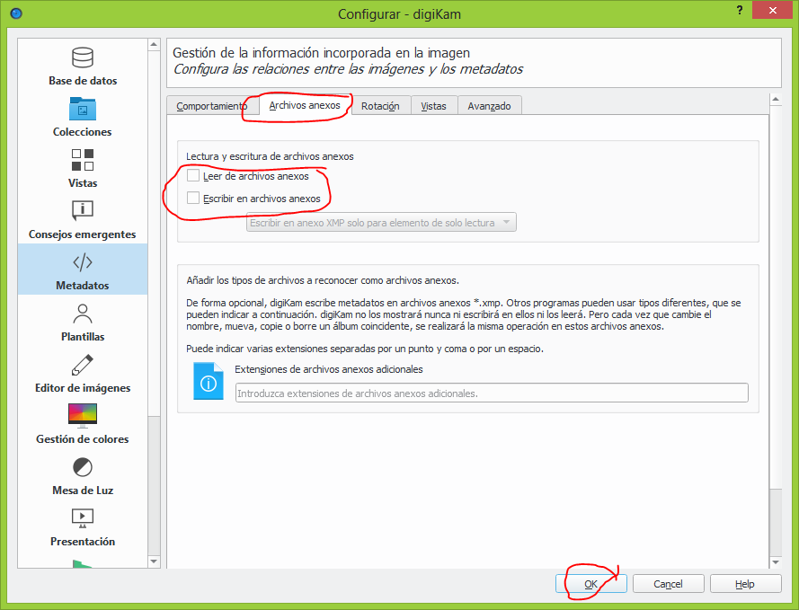

Luego, en la pestaña "Archivos anexos", asegurar de que no están marcadas estas dos opciones, de forma tal que las etiquetas serán escritas en los mismos metadatos de los archivos de las fotos (JPEG u otro formato).

Dar OK cuando esté listo.

# Importar fotos

El digiKam por defecto trabaja sobre la carpeta "Mis Imagenes" en windows. Esto se puede cambiar en las configuraciones (no veremos cómo aquí).

Mostraremos como importar las imágenes a la colección de digiKam, usando dicho programa. Este método implica hacer una copia de todas las fotos, dejando las originales sin tocar.

> En caso de que ya tener en "Mis Imagenes" las fotos de las cámaras trampa, digiKam las agregará automáticamente a su colección. Por lo tanto **una forma de importar las fotos a digiKam es directamente copiar (o cortar) y pegar las fotos en "Mis Imagenes"** (o la carpeta en la que trabaja digiKam). Si opta por este método, siga hasta la sección "Mirando la colección".

## Elegir carpeta con fotos originales

Lo primero es elegir la pestaña Álbumes, a la izquierda/arriba y luego asegurarse de que está marcado el álbum "Pictures", en el panel de navegación. Finalmente, en el menú Importar > Añadir carpetas...

## Elegir carpeta

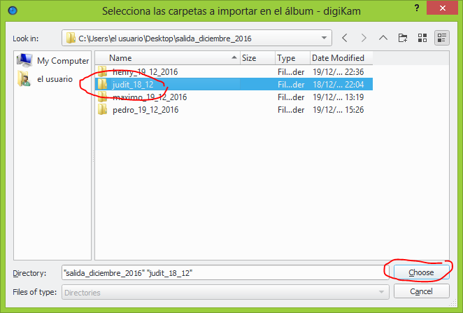

Aquí simplemente hay que navegar por el disco duro hasta encontrar la carpeta que nos interesa importar.

## Elegir álbum

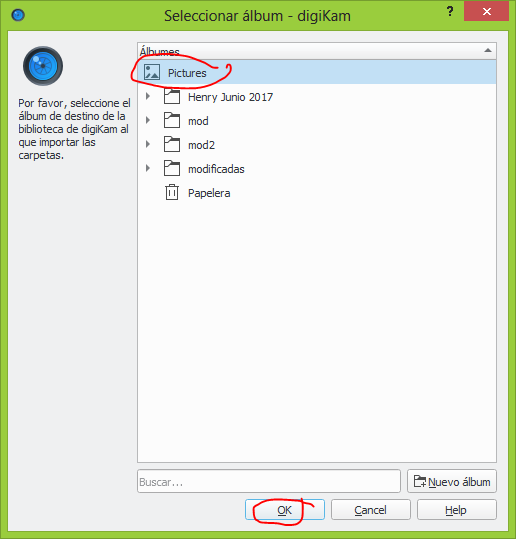

Digikam nos da la opción de incluir las fotos dentro de algún álbum preexistente. En nuestro ejemplo usamos Pictures.

## Resultado

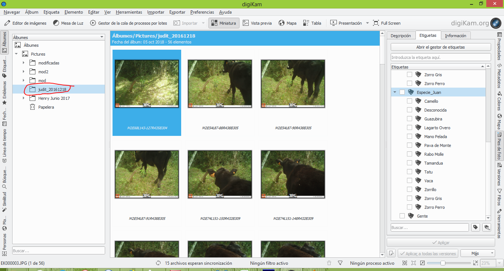

Luego de importar aparece el nuevo álbum en el panel de navegación de álbumes.

Cada álbum de digiKam corresponde a una carpeta de archivo en el disco duro (en "Mis Imágenes", en el ejemplo nuestro).

# Mirando la colección

Tenemos varias formas de mirar las fotos en digiKam: miniaturas, vista previa y tabla

## Miniaturas

En este modo puede ajustar el tamaño de las fotos con los botones de abajo a la derecha. En una pantalla de buen tamaño, usar un gran tamaño de foto puede ser una buena opción para realizar el etiquetado.

En caso de tener fotos ya etiquetadas, aparecerán las etiquetas debajo de cada miniatura.

Usando el modo miniaturas (y vista previa también), es bueno tener en cuenta que el nombre de la foto (ie: del archivo) aparece abajo a la izquierda:

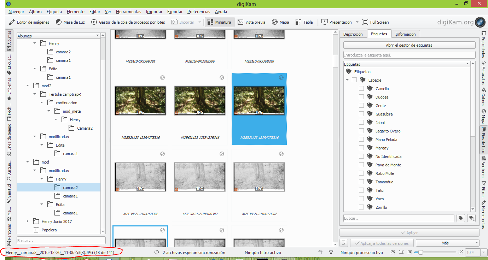

## Vista previa

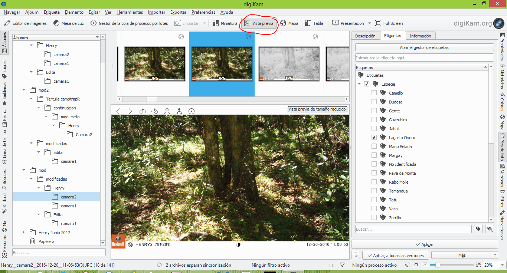

Esta es la opción que nosotres usamos para etiquetar fotos (usamos pantallas más bien chicas).

## Tabla

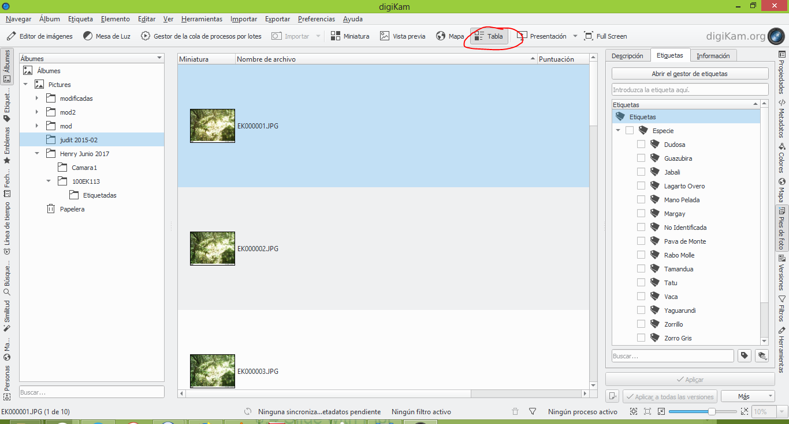

Simplemente otra opción de visualización.

# Etiquetas

Ahora sí, entremos en el proceso de etiquetar fotos.

## Colección de etiquetas

Lo primero es conocer el gestor de etiquetas, el cual sirve para crear, borrar y mover etiquetas. Hay que abrir el panel "Pies de foto", sobre la derecha.

Luego apretar el botón "Abrir el gestor de etiquetas".

## Nueva etiqueta

Para crear una nueva etiqueta, debemos tener en cuenta que estas se organizan en una jerarquía: hay etiquetas madre y etiquetas hijas.

### Etiqueta madre

Para crear la primera de todas las etiquetas, podemos apretar el botón derecho del ratón en el espacio en blanco del gestor y seleccionar "Nueva etiqueta...". Esto creará una etiqueta madre.

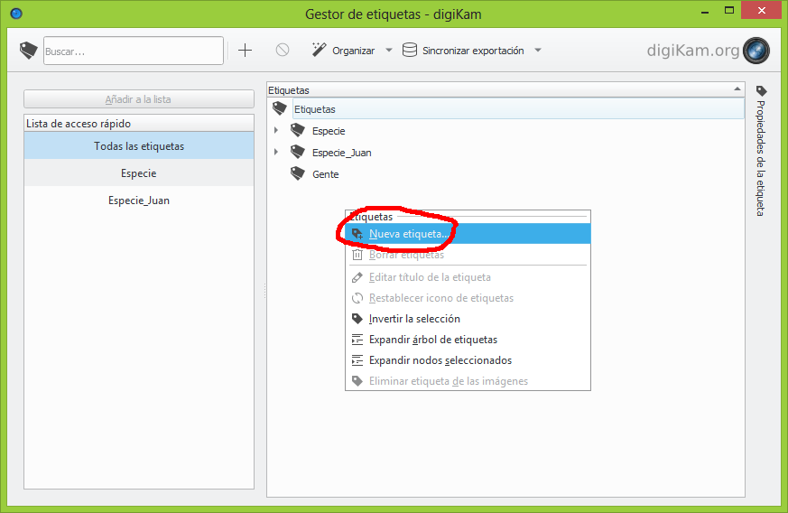

En el ejemplo que nos incumbe, hicimos una etiqueta madre llamada Especie, para agrupar en esta categoría los nombres de las especies. Esto es útil si queremos tener otras categorías. Ejemplos de esto pueden ser:

- Comportamiento
    + caminar
    + jugar
    + comer
    + marcar territorio
    + ...
- Edad
    + cría
    + juvenil
    + adulto
- Cantidad
    + uno
    + dos
    + tres
    + muchos

(Todo dependerá de las preguntas que queremos responder con nuestro conjunto de fotos.)

### Etiqueta hija

Si en cambio queremos crear una etiqueta hija de una preexistente, debemos primero pinchar la etiqueta madre (en este caso, "Especie") y luego añadir etiqueta.

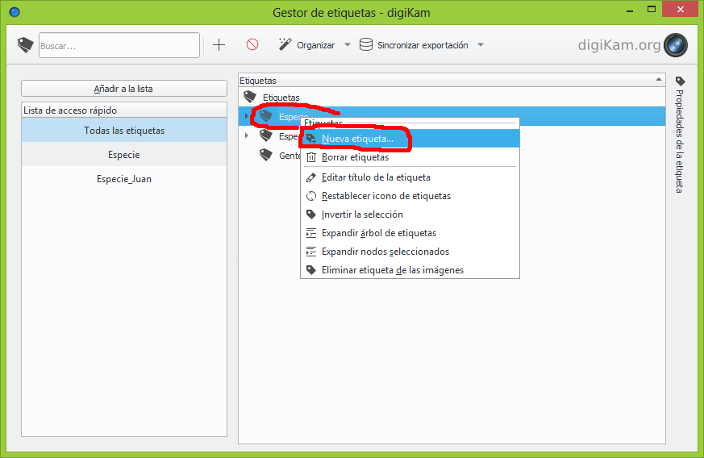

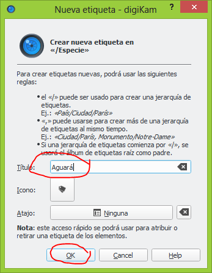

## Asignar etiquetas

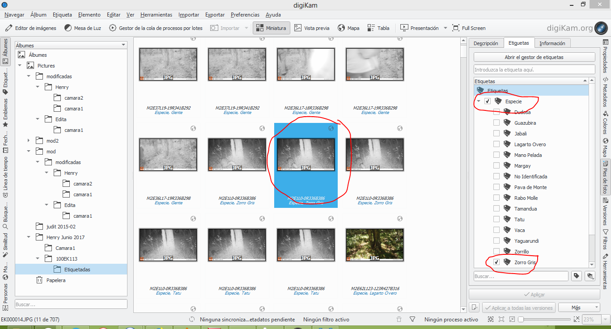

Para asignar etiquetas a una foto, seleccionamos la foto y luego marcamos en el panel lateral las etiquetas que nos parecen adecuadas. Aquí debemos marcar tanto etiqueta madre como hija. De no hacerlo, quedará sólo una de las dos (aún si se trata de una etiqueta hija).

Luego de marcarlas, debemos apretar el botón "Aplicar".

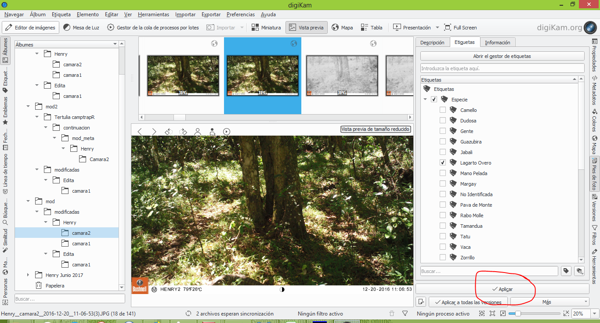

## Mover o eliminar etiquetas

Con el gestor de etiquetas podemos borrar etiquetas de la colección, usando el botón derecho del ratón.

Para mover una etiqueta dentro del gestor de etiquetas podemos arrastrarla, usando el ratón, de forma que cambiamos de etiqueta madre (no hay captura de pantalla para esta acción).

## Ver etiquetas de la foto

Utilizando el botón "Etiquetas ya asignadas" en el panel "Pies de foto" (abajo a la derecha), podemos ver fácilmente las etiquetas asignadas a una foto (o fotos) determinada(s).

## Más de una identificación

Puede ocurrir que el usuario por defecto identifique a la especie como Zorro Gris, pero que Juan la halla identificado como Zorro Perro. Este es un conflicto de identificación.

Para hacer explícito el conflicto es que hemos creado, para el ejemplo, la etiqueta madre "Especie_Juan". Debe estar al mismo nivel que "Especie" (ie: etiqueta madre) y contener los mismos nombres de especie en ambas categorías.

En el siguiente ejemplo tenemos una foto con más de una especie asignada:

Más tarde, trabajando con camtrapR, veremos una forma de listar y resolver estos conflictos. Se trata, en resumen, de filtrar aquellos en que el nombre de la especie bajo la etiqueta "Especie" es diferente del nombre de la especie bajo la etiqueta "Especie_Juan".

(Podemos cambiar la etiqueta "Especie" por "Especie_Gabi", si queremos explicitar que fue Gabi quién realizó la primer identificación.)

## De a muchas fotos

Podemos marcar las mismas etiquetas para un conjunto de fotos si primero seleccionamos varias fotos (Shift + botón izquierdo del ratón):

## Guardar los cambios

Es importante recordar que ninguna de las etiquetas asignadas será guardarda en los archivos de las fotos hasta que no ejecutemos "Escribir metadatos en las imagenes", ubicado en el menú Álbum:

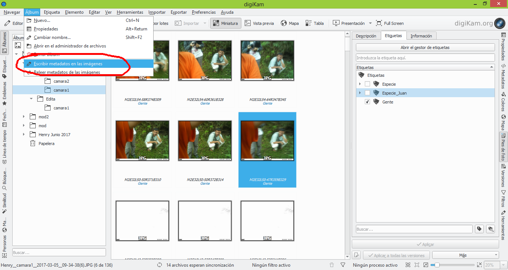

(En el menú Elemento > "Escribir metadatos en las imagenes seleccionadas" podemos guardar los metadatos de algunas de las fotos, en vez de todo el álbum.)

# Opciones de navegación

Para sacarle el jugo a digiKam, es útil usar las distintas opciones que ofrece para navegar entre las fotos de la colección.

## Álbumes

Con el botón Álbumes, sobre la izquierda, vemos las fotos dentro de cada álbum (recordar que 1 álbum = 1 carpeta).

## Etiquetas

Con el botón etiquetas podemos seleccionar aquellas etiquetas que nos interesan (con Ctrl + botón izquierdo del ratón, para elegir varias).

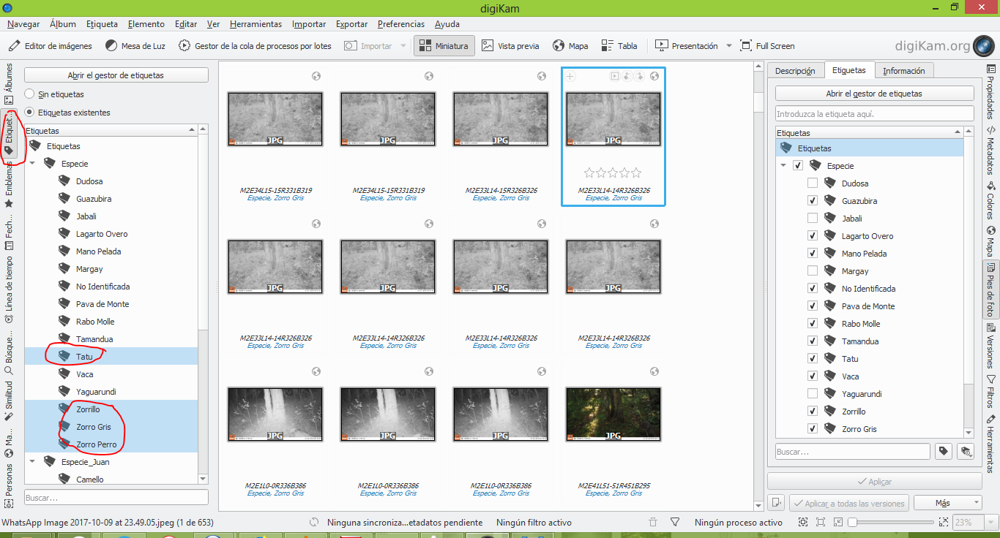

## Fecha

El botón Fecha nos permite seleccionar fotos por año o por año + mes en que fueron sacadas. El calendario nos indica los días para los que hay registros.

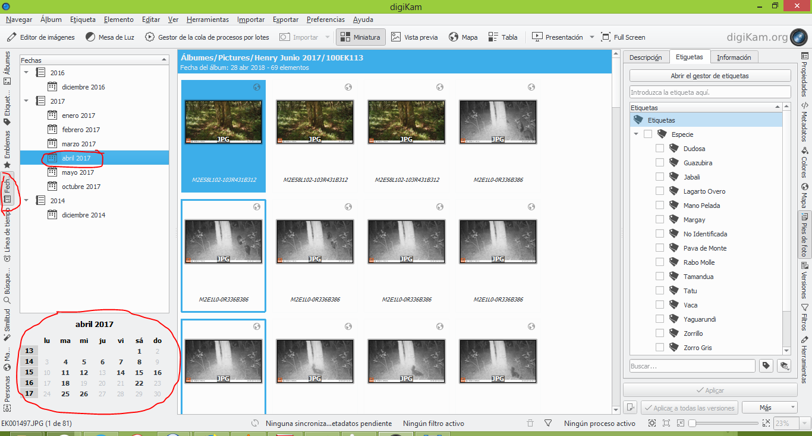

# FIN

En definitiva, estas son las funcionalidades más importantes que nos pareció relevante mostrar.

